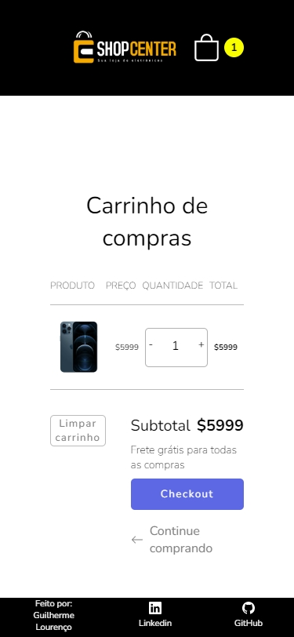
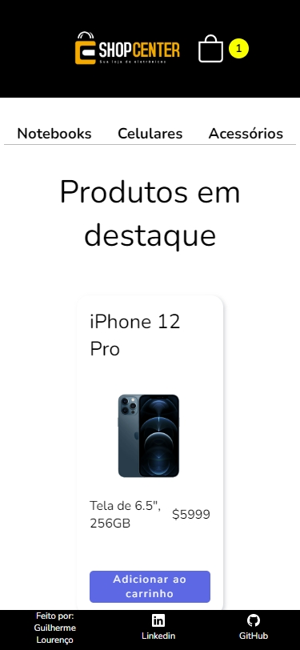
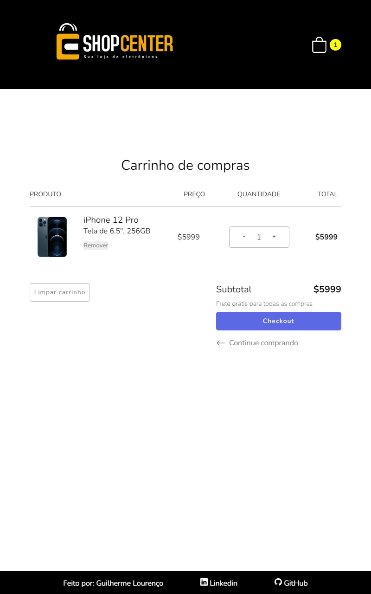
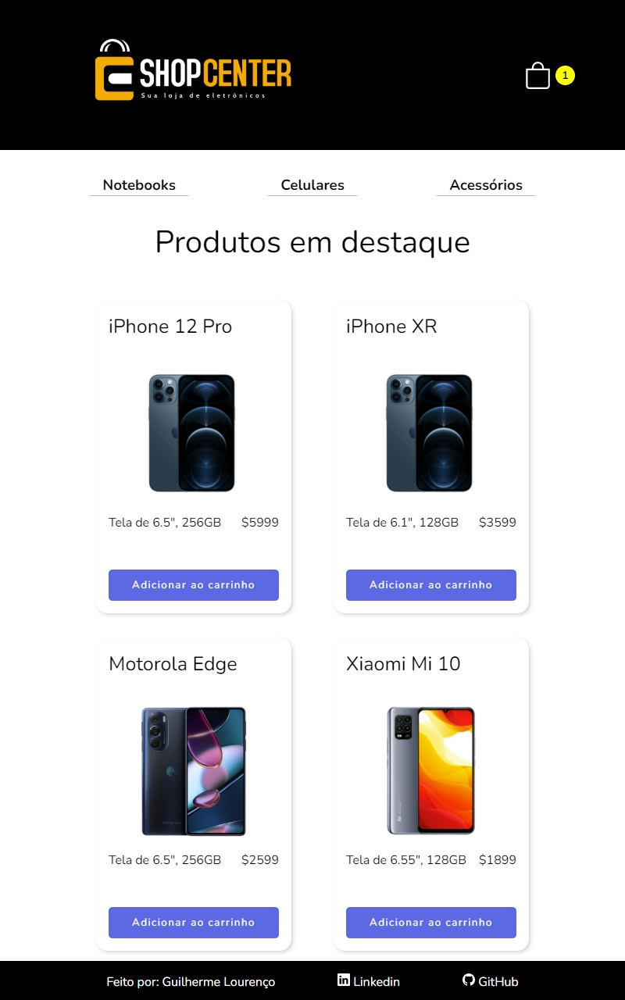
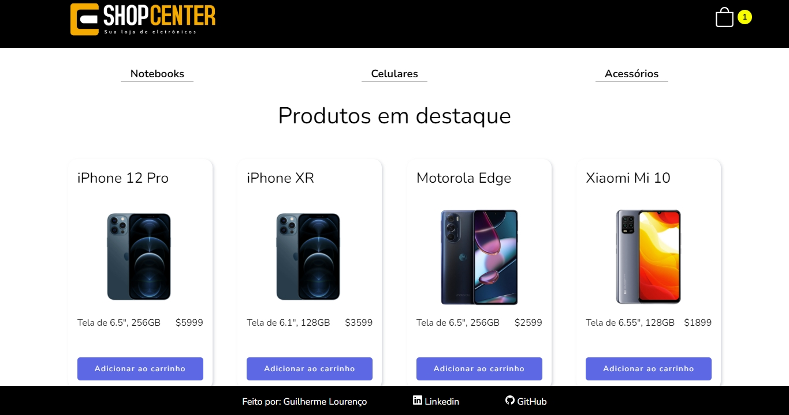
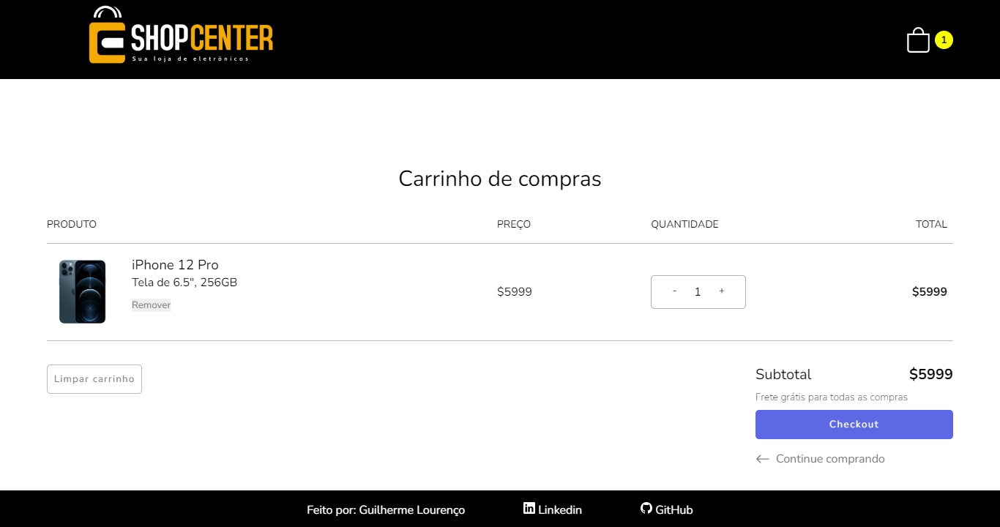
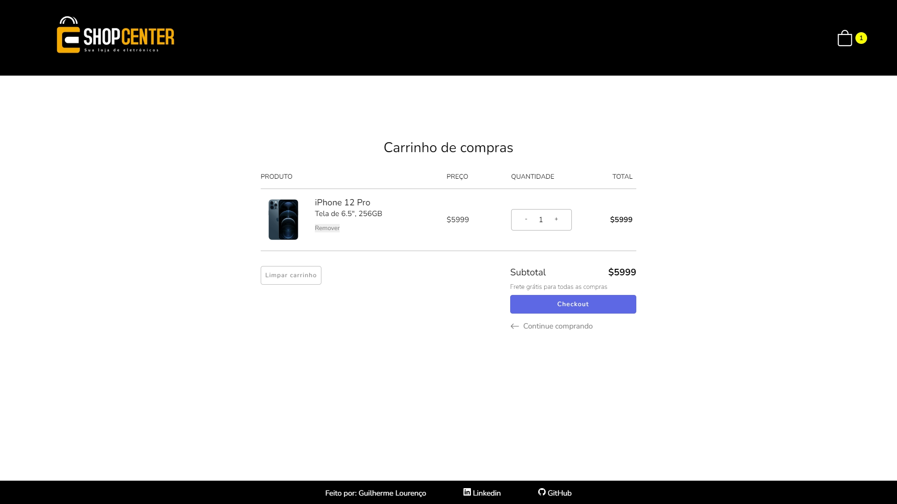
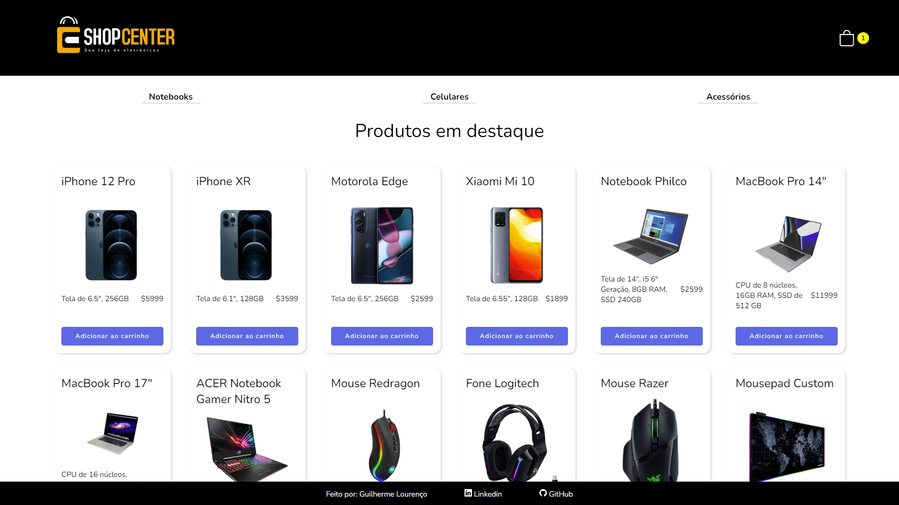

# Projeto eCommerce

# Link do projeto
- https://e-commerce-frontend-deploy-one.vercel.app/
# Descrição 
- Este projeto foi feito  com o intuito de entender melhor sobre React e suas ferramentas, utilizei React Toolkit para a comunicação dos componentes, 
API feita em Express.
# Funcionalidades
- Neste projeto consigo adicionar e remover produtos do carrinho,
limpar todos os itens, aumentar a quantia de itens dentro do carrinho e selecionar produtos conforme seu tipo

# Imagens
 

# Autor do projeto

- https://www.linkedin.com/in/guilherme-louren%C3%A7o-lopes-81650b215

